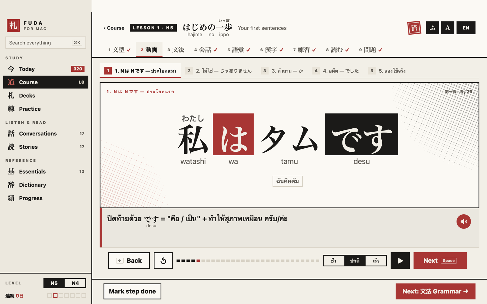
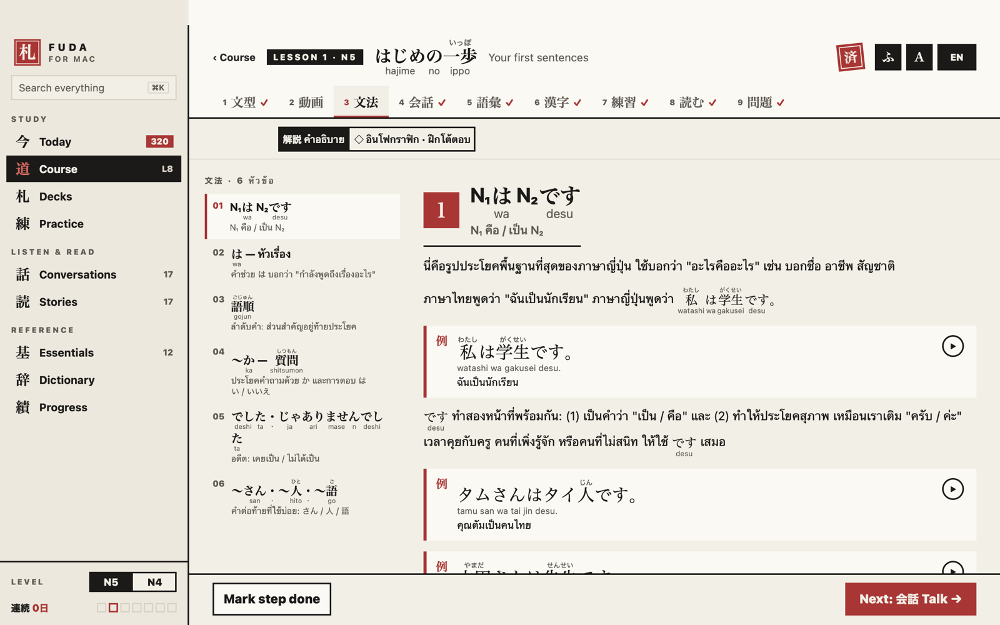
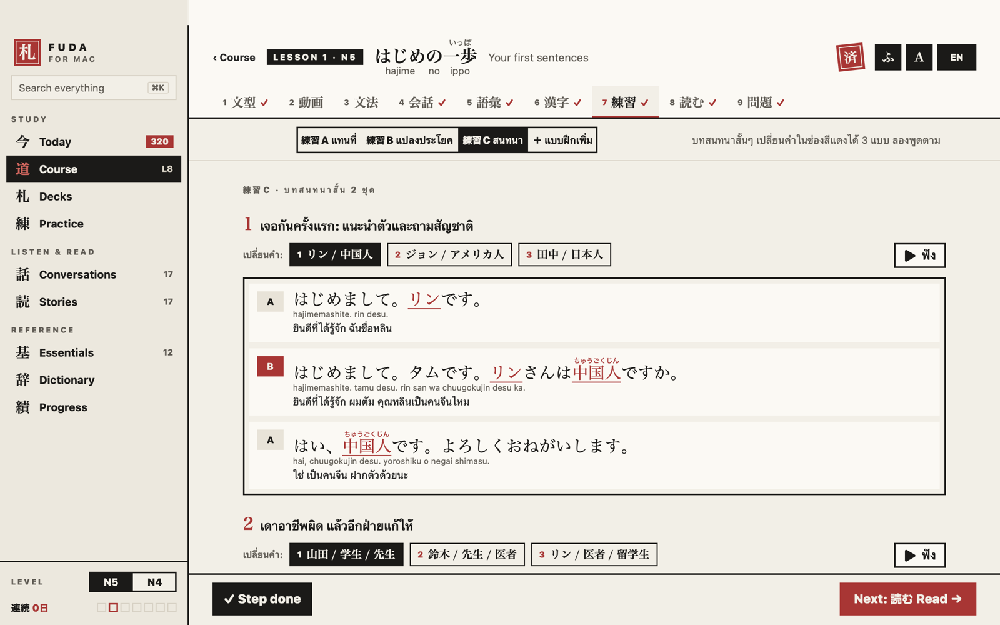

# 札 Fuda for Mac — learn Japanese N5 → N4 like a textbook

A macOS app (SwiftUI, macOS 14+) that teaches JLPT N5 and N4 Japanese to Thai
speakers: a 32-lesson course you work through like a textbook with a video
course beside it, plus flashcards with spaced repetition, conversations, graded
stories and reference chapters. Everything is in the app; the teaching language
is Thai.



## Run

Open `FudaMac.xcodeproj` in Xcode and run the **FudaMac** scheme, or:

```bash
xcodebuild -project FudaMac.xcodeproj -scheme FudaMac -destination 'platform=macOS' build
```

The project uses folder-synced groups: any file added under `FudaMac/` or the
shared core folders is part of the target automatically.

## The course

One path of 33 lessons (0 kana, then 1–32) that teaches all of N5 and N4
together, in six parts (第一部–第六部). Grammar goes in teaching order; every
one of the 1,887 words (all N5 + N4 from the JLPT lists and the beginner textbook vocabulary, greetings, plus 172 everyday N4+ words just above N4), 284 kanji and 185 grammar points is taught in exactly
one lesson, words mixed by topic (`Tools/course_words.py`). Each part ends with
a 復習 review test, and 総まとめ is a final review over the whole course.
Each textbook lesson
(`FudaMac/Resources/textbook-LNN.json`) has nine steps:

| | Step | What you do |
|---|---|---|
| 1 | 文型 Patterns | Can-do goals, the key sentence patterns, Q/A examples with audio |
| 2 | 動画 Video | A chaptered, self-playing animated lesson: sentences build token by token, wrong → right, timelines for tense and aspect. Thai subtitles, Japanese audio, pause (K), speed ช้า / ปกติ / เร็ว |
| 3 | 文法 Grammar | Deep notes per grammar point: explanation, examples, conjugation tables, tips, common mistakes of Thai speakers, side-by-side comparisons. ◇ opens interactive infographics |
| 4 | 会話 Talk | The lesson conversation (a continuing story of タム, a Thai student in Tokyo), plus the lesson talk told twice: 友達と with a friend (casual) and 丁寧に politely (teacher, staff, landlord; keigo in lesson 32). Read and listen, or role-play タム |
| 5 | 語彙 Words | The lesson's vocabulary as flashcards (joins your daily reviews) |
| 6 | 漢字 Kanji | The lesson's kanji |
| 7 | 練習 Drills | A: substitution tables · B: type the transformed sentence (kana, kanji, mixed or romaji) · C: mini dialogues with swappable parts |
| 8 | 読む Read | A graded story or the lesson's reading |
| 9 | 問題 Test | Multiple choice, listening and sentence ordering. 70% stamps the lesson 済 |

All lesson text is original. The format, authoring rules and quality bar are in
`Tools/textbook/SCHEMA.md`. Check lessons after editing:

```bash
python3 Tools/textbook/validate.py        # all lessons; or: validate.py 8
python3 Tools/textbook/brief.py 8         # what lesson 8 teaches, its vocab, what came before and after
```

The validator checks the schema, that every `kana` reading matches its `ja`
(furigana alignment), that every kanji in the video has a reading, and minimum
depth (examples, explanations, beats, drills, quiz size).



## Everything else

| Sidebar | |
|---|---|
| 今 Today | Continue the course, reviews due, today's conversation / story / essential |
| 道 Course | The 33 lessons above |
| 語 Word List | All N5 + N4 words (1,423) as lists by theme — 20 categories, 79 subcategories (e.g. 食べ物 → 調味料 seasonings, 食の動詞 eating verbs). Kanji, hiragana and romaji side by side, N5 first then N4. Read the list, or type every meaning in Thai or English and check (⌘↩); **Random** (⌘R) opens the subcategory with the most words you don't know yet |
| 札 Decks · 練 Practice | 1,373 words, 284 kanji, 185 grammar points and kana as flashcards (SM-2 scheduling) and quizzes |
| 話 Conversations | 17 real-life scenes (konbini, station, clinic, …) and the 32 lesson talks (casual + polite), to read with notes or role-play. Every line is tagged with the grammar it uses |
| 読 Stories | 17 graded stories, horizontal or vertical (縦書き), read aloud, comprehension check |
| 基 Essentials | 12 reference chapters with interactive widgets |
| 辞 Dictionary · 績 Progress | Search everything; coverage, course grid, calendar |

Furigana (ふ) and romaji (A) toggles apply to every piece of Japanese in the app,
including Japanese inside Thai explanations. Readings come from the lesson data;
where there is none, the system tokenizer reads the text and a learner lexicon
corrects it (`Fuda/Theme/JPText.swift`).

Keyboard: Space next / flip, 1–4 answer or grade, ← → back / next, P play audio,
K pause the video, ⌘1–9 sections, ⌘K search, ⌥1–9 lesson steps, Esc back.



Lesson talks are written in `Tools/talks/LNN.txt` (format in the header of
`Tools/build_conversations.py`). Every grammar point of a lesson must be used by a
line of its pair, and each grammar note shows a friend line and a polite line that use it:

```bash
python3 Tools/build_conversations.py --check    # validate only
python3 Tools/build_conversations.py            # → Fuda/Resources/conversations.json
```

## Word list

`Tools/wordlist/` is the source: `taxonomy.json` (categories), `assignments.json`
(every word → subcategory, English gloss, extra Thai answers) and `extra_vocab.json`
(words the Tone export lacked, and the `"plus": true` N4+ words: everyday words a step
above N4, mostly N3, for real conversation). `course_anchor.json` pins words to the
course lesson where they are first taught (greetings, textbook words). A word can be
listed in a second subcategory with `"more"` (切る: hand actions and cooking).
Build after editing:

```bash
python3 Tools/wordlist/fix_vocab.py                             # applies vocab_fixes.json (corrections, duplicate removal)
python3 Tools/wordlist/build_wordlist.py                       # writes Fuda/Resources/wordlist.json + vocab-extra.json
python3 Tools/wordlist/build_wordlist.py --reference DIR       # also check coverage (DIR has n5.csv, n4.csv)
```

Coverage was checked against the tanos.co.uk JLPT lists (the usual reference since
the JLPT stopped publishing lists): 72 missing words were added (犬, 水, 肉, 猫, 冬,
出る, 教える, 気, 火, 市 …); what remains are spelling variants (朝御飯 ↔ 朝ご飯).
Duplicate spellings in the source (しょうゆ / 醬油 / 醤油, 入院 / 入院する) show as one
entry with the other forms listed under it.

## Layout

```
FudaMac/            Mac app: views, course + textbook models, lesson resources
Fuda/Data           shared core: content database, cards, kana, conversations, romaji
Fuda/Store          SRS scheduler, progress, sessions, quizzes, speech
Fuda/Theme          colours, halftone drawing, furigana / romaji text
Fuda/Resources      content.json (words, kanji, grammar), conversations.json
Tools/              data export and build scripts, textbook validator
```

Progress is stored as JSON in the app's Application Support folder:
`progress.json` (card reviews) and `course-progress.json` (lesson steps, tests,
stories, conversations).

## Debug

`-FudaShots <dir> [-FudaDemo YES] [-FudaWindow 1280x800]` walks the main screens,
saves a PNG of the window for each, then quits. `-FudaShotsSet tb` limits it to
the textbook screens; `-FudaShotsLesson 8` shoots every step of lesson 8.
